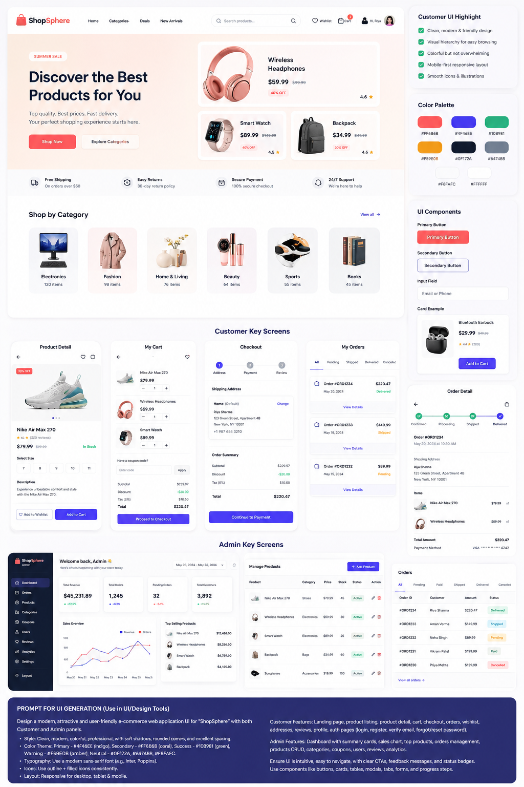
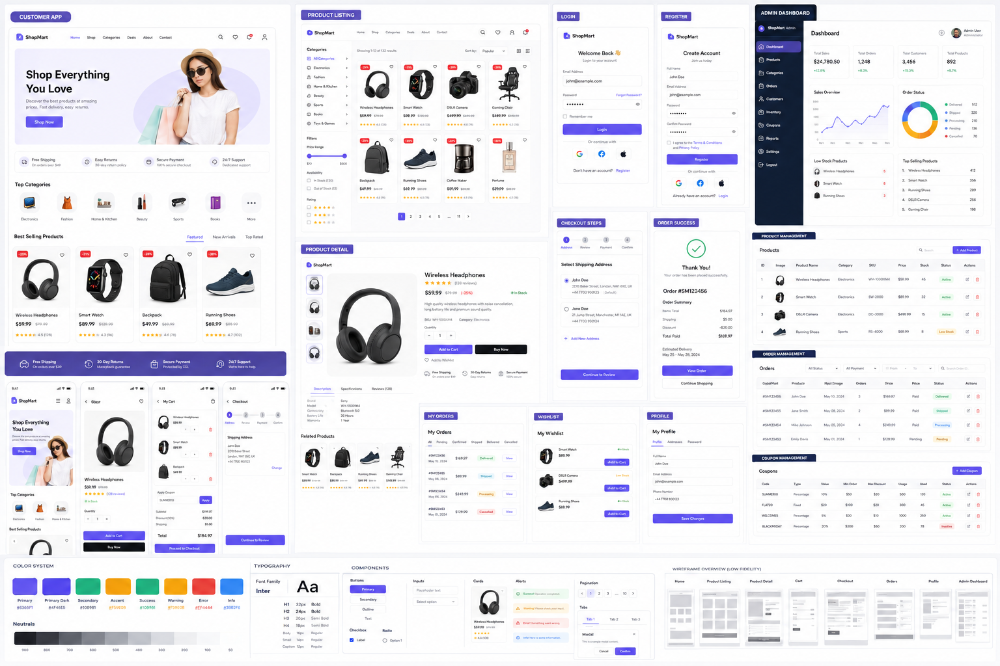

# ShopSphere

A full-stack e-commerce platform with a customer storefront and a full admin back-office — built with **Spring Boot + MySQL** on the backend and **React + Vite** on the frontend.



## Features

**Customer-facing**
- Landing page, category browsing, product listing with filters, product detail with reviews/ratings
- Cart, multi-step checkout, order history, wishlist, profile & address management
- JWT auth (short-lived access token + refresh token) with required email verification

**Admin dashboard**
- Sales/orders/customers/products summary cards, interactive revenue & order-status charts
- Full CRUD for products, categories, inventory, orders, coupons, and users
- File-based image upload for product/category images

## Tech stack

| Layer | Stack |
|---|---|
| Backend | Spring Boot, Spring Security (JWT), Spring Data JPA, Flyway migrations |
| Database | MySQL |
| Frontend | React, Vite |
| Auth | Short-lived access tokens + long-lived refresh tokens, email verification |

## Design reference



## Running locally

**Backend** (`shopsphere-backend/`)
```
./mvnw spring-boot:run
```
Configure via environment variables (see `application.properties`): `DB_USERNAME`, `DB_PASSWORD`, `JWT_SECRET`, `MAIL_USERNAME`, `GMAIL_APP_PASSWORD`.

**Frontend** (`shopsphere-frontend/`)
```
npm install
npm run dev
```
